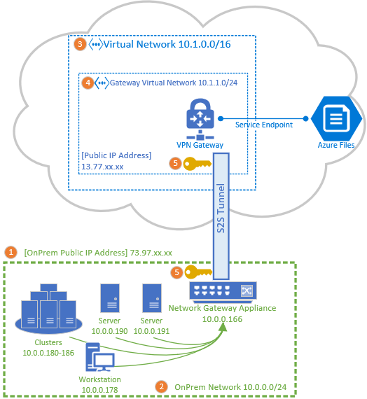

Site To Site Instructions 

# Overview
## Topology Diagram – with a Visio diagram
### Topology description

(./images/site2sitetemplate.png)
## Prerequisites 
* You already have a storage account
* List of compatible devices – Link to list of compatible devices
    https://docs.microsoft.com/en-us/azure/vpn-gateway/vpn-gateway-about-vpn-devices
* List of subnets- what DC are you planning to connect to – Link to the mapping
    https://www.microsoft.com/en-us/download/confirmation.aspx?id=41653
* Have access to the network appliance  that is intended to route to Azure
* Have atleast 1 client machine that is connected to the network appliance
## Steps
### Step 1 – Deploy ARM template

* Description table of each parameter with example values
* Template Buttons
### Step 2 – Configure Onprem network appliance that performs the IKEV2 (This step can be done by IT Admin/Network Admin)
### Step 3 – Mount to test that connection works
### Step 4 – Persistent mount for reboots
### Conclusion
